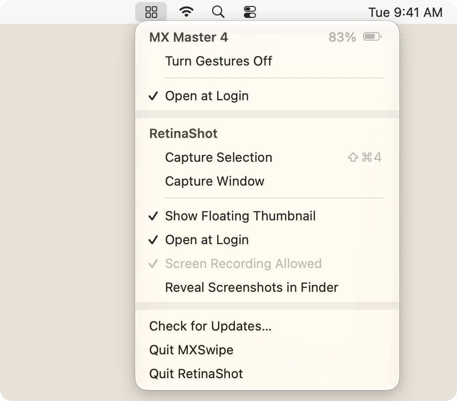

# MenuHub

Lets cooperating menu-bar apps share one icon. Each app describes its part of the menu; the app that has
been running longest shows a single icon, and its menu holds every running app's section. An app on its
own shows its own icon and menu, exactly as if it didn't share.

Used by [MXSwipe](https://github.com/mstallone/mxswipe) and [RetinaShot](https://github.com/mstallone/retinashot).

<p align="center">
  <picture>
    <source media="(prefers-color-scheme: dark)" srcset="assets/menu-dark.png">
    
  </picture>
</p>

## Using it

```swift
import MenuHub
import MenuHubSparkle

menu = MenuHub(symbol: "computermouse", updater: SparkleUpdater()) {
    MenuSection(header: MenuHeader(title: "MX Master 4", detail: .battery(83)), items: [
        .action("Turn Gestures Off") { self.toggleGestures() },
        .separator,
        .action("Open at Login", isOn: self.opensAtLogin) { self.toggleLogin() },
    ], isActive: self.isConnected)
}
```

The section is read again whenever the menu opens; call `update()` when something it shows changes in the
meantime. The hub adds the app's Quit item, and its version while the app has the menu to itself. Items
can be actions (with an optional subtitle, key equivalent, checkmark, or disabled state), Option-key
alternates, lines of information, headings, submenus, and separators. `isActive: false` fades the icon.
Setting `symbol` shows a different SF Symbol while it's set, for a state worth seeing at a glance, like
recording; when menus are combined it replaces the shared icon too, so the state isn't hidden.

`updater` adds Check for Updates…. `SparkleUpdater`, in the `MenuHubSparkle` library, updates the app with
[Sparkle](https://sparkle-project.org), configured by the usual keys in its Info.plist, and runs Sparkle's
scheduled checks. The app embeds and signs Sparkle.framework as for any Sparkle app. An app that doesn't
update this way uses only `MenuHub`, which has no dependencies. Another updater can conform to `Updater`.

## How it works

- Apps exchange distributed notifications: a JSON description of each app's section, a request for
  everyone to send theirs again, a click, a goodbye, and the two messages of an update check. An app that crashes is noticed through
  `NSWorkspace`'s list of running apps.
- The app with the earliest launch shows the icon, so it stays put while others come and go; when that
  app quits, the next takes over. A newly launched app waits 300 ms before showing an icon, so an app
  that is about to join someone else's menu never flashes its own.
- Combined, each app's section gets a header (its own, or its name), sections are divided by a gap, and
  each app has a Quit item at the bottom. The icon is a grid, bright while any app is active.
- Combined, one Check for Updates… covers every app with an updater. Each checks quietly; an app that
  finds an update shows it in its own window, since it installs itself, and the rest are summed up in a
  single alert, shown only when every app is up to date or one couldn't check. On its own, or when no
  other app has an updater, an app runs its usual check.
- A process tracking a menu gets its global hot keys only after the menu closes. An app whose hot keys
  must work while the menu is open, like a screenshot tool capturing it, passes `yieldsIcon: true` and
  shows the icon only when no app that doesn't yield is running. `onMenuOpen` reports when the app's own
  menu opens and closes, so it can release its hot keys and let the menu's key equivalents take them.
- A click is sent to the app that described the item, with the revision of the description the menu was
  drawn from; a click on an outdated menu is dropped rather than run against the wrong item.
- The header, divider, and Quit rows are drawn by MenuHub so they can start at the checkmark column.
  They use the same selection material and text colors as native items. AppKit ignores Return on items
  drawn this way, so the Quit rows respond to clicks and VoiceOver but not Return.

Distributed notifications carry no sender identity, so any process in the login session could post a
fake description or click. Menu items should do nothing a local process couldn't already ask for.
Sandboxed apps can't attach data to distributed notifications, so apps using MenuHub can't be sandboxed.

## Building

`swift test` runs the tests. `Tools/make-preview.swift` renders the images above from sample sections
and the package's own layout code:

    swiftc -O -parse-as-library Tools/make-preview.swift Sources/MenuHub/*.swift -o .build/make-preview
    .build/make-preview assets

Requires macOS 14 or later and Swift 6.

## License

MIT. See [LICENSE](LICENSE).
